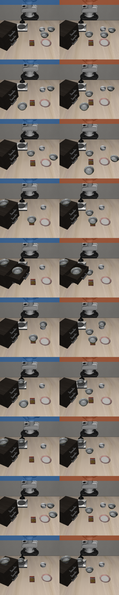

# OpenVLA · LIBERO-Spatial — Explicit vs. Default Instruction Evaluation

**Model:** `openvla-7b` LoRA (r32) fine-tuned on `libero_spatial_no_noops` (bf16 + FlashAttention-2, center-crop)
**Suite:** `libero_spatial` — 10 tasks × 50 trials = **500 rollouts** per condition
**Env:** `openvla-libero:cuda12.1` Docker (mujoco 2.3.2, robosuite 1.4.1, EGL headless on NVIDIA)
**Hardware:** 5× H200 (GPUs 0–4), tasks round-robin sharded 2/GPU
**Seed:** 7

The only difference between the two conditions is the **prompt string**. Each scene contains two
identical black bowls (target + distractor); the scene, objects, and initial states are identical.

- **Default:** names only the target — e.g. *"pick up the black bowl on the stove and place it on the plate."*
- **Explicit:** additionally names where the distractor is — *"…, not the one on top of the wooden cabinet, …"*

---

## Headline

| Condition | Overall success | Rollouts |
|---|---:|---:|
| **Default (ordinary)** | **84.0%** | 420 / 500 |
| **Explicit (distractor-aware)** | **36.8%** | 184 / 500 |
| **Δ (explicit − default)** | **−47.2 pts** | |

Adding the explicit distractor clause **hurts** the baseline model across almost every task.

---

## Per-task comparison (by task ID)

| ID | Default | Explicit | Δ | Target |
|---:|--:|--:|--:|---|
| 5 | 94% | 4% | **−90** | on the ramekin |
| 0 | 92% | 94% | +2 | between the plate and the ramekin |
| 2 | 92% | 2% | **−90** | table center |
| 6 | 90% | 72% | −18 | next to the cookie box |
| 1 | 84% | 32% | −52 | next to the ramekin |
| 3 | 84% | 52% | −32 | on the cookie box |
| 8 | 84% | 36% | −48 | next to the plate |
| 4 | 76% | 64% | −12 | in the top drawer of the wooden cabinet |
| 7 | 72% | 4% | −68 | on the stove |
| 9 | 72% | 8% | −64 | on the wooden cabinet |

---

## Observations

- **Baseline is strong and uniform with ordinary instructions** — 72–94% across all 10 tasks.
- **The distractor clause regresses performance almost everywhere (−47 pts overall).** Rather than
  aiding disambiguation, the extra *"…not the one on the X…"* phrasing appears to confuse the policy.
- **Largest drops** occur where the distractor phrase names a salient surface: ramekin (−90),
  table center (−90), stove (−68), wooden cabinet (−64).
- **Only unaffected task:** "between the plate and the ramekin" (92% → 94%), the one already phrased relationally.

---

## Explicit instructions used (distractor clause in **bold**)

| Default target | Explicit instruction |
|---|---|
| between the plate and the ramekin | pick up the black bowl between the plate and the ramekin, **not the one next to the ramekin**, and place it on the plate |
| from table center | pick up the black bowl at the center of the table, **not the one next to the plate**, and place it on the plate |
| in the top drawer of the cabinet | pick up the black bowl inside the top drawer of the wooden cabinet, **not the one on top of the cabinet**, and place it on the plate |
| next to the cookie box | pick up the black bowl next to the cookie box, **not the one on the stove**, and place it on the plate |
| next to the plate | pick up the black bowl next to the plate, **not the one next to the ramekin**, and place it on the plate |
| next to the ramekin | pick up the black bowl next to the ramekin, **not the one next to the cookie box**, and place it on the plate |
| on the cookie box | pick up the black bowl on top of the cookie box, **not the one on top of the wooden cabinet**, and place it on the plate |
| on the ramekin | pick up the black bowl on top of the ramekin, **not the one on top of the cookie box**, and place it on the plate |
| on the stove | pick up the black bowl on the stove, **not the one on top of the wooden cabinet**, and place it on the plate |
| on the wooden cabinet | pick up the black bowl on top of the wooden cabinet, **not the one on the stove**, and place it on the plate |

---

## Reproduce

```bash
cd /home/ec2-user/aliy/vla_ws/docker/openvla_libero

# Default (ordinary) instructions, 5 GPUs:
USE_EXPLICIT_PROMPT=False GPUS="0,1,2,3,4" bash eval_explicit_libero_spatial_multigpu.sh

# Explicit distractor-aware instructions, 5 GPUs:
USE_EXPLICIT_PROMPT=True  GPUS="0,1,2,3,4" bash eval_explicit_libero_spatial_multigpu.sh
```

**Config**
- Checkpoint: `/home/ec2-user/wenhan/openvla/checkpoints/baseline_lora_libero_spatial_4gpu_b24_run004/openvla-7b+libero_spatial_no_noops+b24+lr-0.0005+lora-r32+dropout-0.0--image_aug`
- Scenes / init states / BDDLs: `vla_ws/LIBERO/libero/libero/bddl_files/libero_spatial/` (two-bowl variants)
- Action un-norm stats: checkpoint `dataset_statistics.json` (key `libero_spatial_no_noops`)
- Note: the `modified_libero_rlds` RLDS path is training data and is **not** read at eval time.

**Artifacts**
- Per-shard logs: `experiments/logs/EVAL-…--{default,explicit}_instructions--shard{0..4}of5.txt`
- Rollout videos: `experiments/rollouts/<date>/` (tagged with task + success)

---

# Follow-up · Extra distractor (three bowls) — default instructions

Same 10 tasks, checkpoint, seed (7), and **default (target-only)** prompts as above, but
each scene gets a **third** `akita_black_bowl` — one additional distractor — placed at the
open table center (table front for the *"from table center"* task, whose target already sits
at center). This isolates the effect of adding a distractor while the instruction still names
only the target.

Implemented as a **separate suite, `libero_spatial_3bowl`**, so the canonical two-bowl
benchmark is untouched. Task names and order match `libero_spatial` exactly, so task ids line
up 1:1 and the numbers are directly comparable to the two-bowl default column above.

## Headline

| Condition (default instructions) | Overall success | Rollouts |
|---|---:|---:|
| **Two bowls** (target + 1 distractor) | **84.0%** | 420 / 500 |
| **Three bowls** (target + 2 distractors) | **80.2%** | 401 / 500 |
| **Δ (3-bowl − 2-bowl)** | **−3.8 pts** | |

Adding a second distractor bowl costs only ~4 points overall — the policy still usually picks
the correctly-located bowl — but the effect is very uneven across tasks.

## Per-task comparison (by task id)

| ID | Target | 2-bowl | 3-bowl | Δ |
|---:|---|--:|--:|--:|
| 0 | between the plate and the ramekin | 92% | 76% | −16 |
| 1 | next to the ramekin | 84% | 90% | +6 |
| 2 | table center | 92% | 94% | +2 |
| 3 | on the cookie box | 84% | 86% | +2 |
| 4 | in the top drawer of the wooden cabinet | 76% | 84% | +8 |
| 5 | on the ramekin | 94% | 84% | −10 |
| 6 | next to the cookie box | 90% | 44% | **−46** |
| 7 | on the stove | 72% | 82% | +10 |
| 8 | next to the plate | 84% | 88% | +4 |
| 9 | on the wooden cabinet | 72% | 74% | +2 |

## Observations

- **Overall default-instruction success is robust to one extra distractor (−3.8 pts).**
- **The loss is concentrated, not spread out.** 6/10 tasks are flat or slightly up; one task
  carries almost the entire regression.
- **Largest regression: *"next to the cookie box"* 90% → 44% (−46).** The added center bowl
  lands between the cookie box and the plate, right on the pick-and-place path for this task.
- **Two other tasks drop:** *"between the plate and the ramekin"* (−16) and *"on the ramekin"* (−10).
- **Noise caveat:** with 50 trials/task, 1 SE ≈ ±5.7 pts, so per-task deltas of ≲10 pts
  (tasks 1–4, 7–9) are within noise. The −46 (task 6) and −16 (task 0) are real signal.

## Init-state comparison figure

The three-bowl scenes reuse the two-bowl layouts and add one bowl. The extra free body also
enlarges the restored MuJoCo state vector (**92 → 105 dims**, = +7 qpos +6 qvel), which is why
the suite ships **freshly generated `.pruned_init` files** — the old 92-dim states can't be
loaded into the 105-dim model.



*Left column = two bowls (`libero_spatial`), right column = three bowls (`libero_spatial_3bowl`);
rows are task ids 0–9, top to bottom. Each panel is the actual episode-0 init state restored via
`set_init_state`. Contact sheet of the 3-bowl inits alone: `figures/spatial_3bowl_init_grid.png`.*

Placement was verified quantitatively: across all 500 saved init states the worst bowl-to-bowl
center distance is 0.122 m (bowl ⌀ ≈ 0.115 m) — no overlaps, all bowls at valid heights.

## Reproduce (three-bowl)

```bash
cd /home/ec2-user/aliy/vla_ws/docker/openvla_libero

# Default (target-only) instructions, three bowls, 5 GPUs:
USE_EXPLICIT_PROMPT=False GPUS="0,1,2,3,4" bash eval_libero_spatial_3bowl_multigpu.sh
```

**3-bowl assets**
- BDDLs: `vla_ws/LIBERO/libero/libero/bddl_files/libero_spatial_3bowl/`
- Init states: `vla_ws/LIBERO/libero/libero/init_files/libero_spatial_3bowl/` (50 states/task, dim 105; regenerated inside the eval docker)
- Suite registration: `LIBERO_SPATIAL_3BOWL` + `libero_spatial_3bowl` entry in `libero/libero/benchmark/{__init__.py,libero_suite_task_map.py}`
- `run_libero_eval.py` gained `--unnorm_key` (pass `libero_spatial` so action stats resolve to `libero_spatial_no_noops`)
- Helper scripts: `LIBERO/scripts/{gen_3bowl_init_states,verify_3bowl_init_states,compare_2v3_bowl_init}.py`

**Artifacts**
- Per-shard logs: `experiments/logs/EVAL-libero_spatial_3bowl-…--default_instructions_3bowl--shard{0..4}of5.txt`
- Figures: `experiments/figures/{compare_2v3bowl_grid,spatial_3bowl_init_grid}.png`
