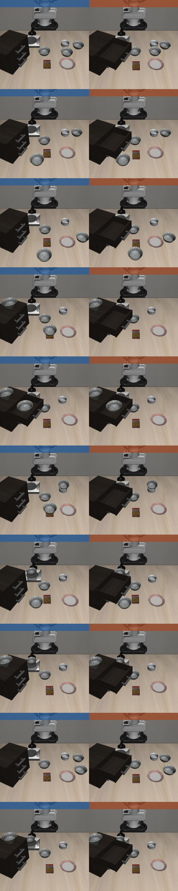

# OpenVLA · LIBERO-Spatial — Instruction & Scene-Robustness Evaluations

How a `libero_spatial`-fine-tuned OpenVLA baseline holds up as we change **the prompt** and
**the scene** — while keeping the model, checkpoint, and seed fixed. Each experiment changes
exactly one thing and is reported against the same 84.0% baseline.

## At a glance

| # | Experiment | What changed | Overall success | vs. baseline |
|--:|---|---|--:|--:|
| — | **Baseline** — default prompt, 2 bowls | — | **84.0%** | — |
| 1 | Explicit prompt | prompt names the distractor too | 36.8% | **−47.2** |
| 2 | Extra distractor | +1 bowl (3 total), default prompt | 80.2% | −3.8 |
| 3 | Cluttered scene | 3 bowls **+ top drawer open**, default prompt | 60.0% | **−24.0** |

**Headlines.** (1) Naming the distractor in the prompt *badly* hurts the policy (−47 pts). (2) Adding
a second distractor bowl barely dents overall success (−3.8 pts) but sinks one specific task. (3)
Opening the cabinet drawer on top of that is far more damaging than the extra bowl — a broad −20 pt
drop (to 60.0%) spread across most tasks, not just one.

---

## Setup (common to all experiments)

- **Model:** `openvla-7b` LoRA (r32) fine-tuned on `libero_spatial_no_noops` (bf16 + FlashAttention-2, center-crop).
- **Base suite:** `libero_spatial` — 10 tasks; each = *"pick up the black bowl \<location\> and place it on the plate."*
- **Protocol:** 50 trials/task = **500 rollouts** per condition. Seed 7. Success = LIBERO goal met.
- **Env:** `openvla-libero:cuda12.1` Docker (mujoco 2.3.2, robosuite 1.4.1, EGL headless).
- **Hardware:** 5× H200 (GPUs 0–4), tasks round-robin sharded 2/GPU.
- **Task ids** are identical across every suite below, so columns line up 1:1:

  | id | target location | id | target location |
  |--:|---|--:|---|
  | 0 | between the plate and the ramekin | 5 | on the ramekin |
  | 1 | next to the ramekin | 6 | next to the cookie box |
  | 2 | table center | 7 | on the stove |
  | 3 | on the cookie box | 8 | next to the plate |
  | 4 | in the top drawer of the wooden cabinet | 9 | on the wooden cabinet |

- **Noise:** at 50 trials/task, 1 standard error ≈ ±5–7 pts, so treat single-task swings ≲10 pts as noise.

---

## Experiment 1 — Prompt phrasing: default vs. explicit (2 bowls)

**Question.** The scene has two identical black bowls (target + 1 distractor). Does *telling the model
which bowl to avoid* help? Only the **prompt string** changes; scene and init states are identical.

- **Default:** names only the target — *"pick up the black bowl on the stove and place it on the plate."*
- **Explicit:** also names the distractor — *"…, not the one on top of the wooden cabinet, …"*

| Condition | Overall | Rollouts |
|---|--:|--:|
| **Default (ordinary)** | **84.0%** | 420 / 500 |
| **Explicit (distractor-aware)** | **36.8%** | 184 / 500 |
| **Δ** | **−47.2 pts** | |

| id | target | Default | Explicit | Δ |
|--:|---|--:|--:|--:|
| 0 | between the plate and the ramekin | 92% | 94% | +2 |
| 1 | next to the ramekin | 84% | 32% | −52 |
| 2 | table center | 92% | 2% | **−90** |
| 3 | on the cookie box | 84% | 52% | −32 |
| 4 | in the top drawer | 76% | 64% | −12 |
| 5 | on the ramekin | 94% | 4% | **−90** |
| 6 | next to the cookie box | 90% | 72% | −18 |
| 7 | on the stove | 72% | 4% | −68 |
| 8 | next to the plate | 84% | 36% | −48 |
| 9 | on the wooden cabinet | 72% | 8% | −64 |

**Takeaway.** The explicit "…not the one on X…" clause *confuses* the policy instead of disambiguating
it (−47 pts overall). Damage is worst where the clause names a salient surface (ramekin, table center,
stove, cabinet). The only unhurt task (0) was already phrased relationally.

<details><summary>Exact explicit prompts used (distractor clause in <b>bold</b>)</summary>

| Default target | Explicit instruction |
|---|---|
| between the plate and the ramekin | pick up the black bowl between the plate and the ramekin, **not the one next to the ramekin**, and place it on the plate |
| from table center | pick up the black bowl at the center of the table, **not the one next to the plate**, and place it on the plate |
| in the top drawer of the cabinet | pick up the black bowl inside the top drawer of the wooden cabinet, **not the one on top of the cabinet**, and place it on the plate |
| next to the cookie box | pick up the black bowl next to the cookie box, **not the one on the stove**, and place it on the plate |
| next to the plate | pick up the black bowl next to the plate, **not the one next to the ramekin**, and place it on the plate |
| next to the ramekin | pick up the black bowl next to the ramekin, **not the one next to the cookie box**, and place it on the plate |
| on the cookie box | pick up the black bowl on top of the cookie box, **not the one on top of the wooden cabinet**, and place it on the plate |
| on the ramekin | pick up the black bowl on top of the ramekin, **not the one on top of the cookie box**, and place it on the plate |
| on the stove | pick up the black bowl on the stove, **not the one on top of the wooden cabinet**, and place it on the plate |
| on the wooden cabinet | pick up the black bowl on top of the wooden cabinet, **not the one on the stove**, and place it on the plate |

</details>

---

## Experiment 2 — Extra distractor: 2 bowls vs. 3 bowls (default prompt)

**Question.** Keep the ordinary (target-only) prompt but make the scene harder: add a **third**
`akita_black_bowl` (a second distractor) at the open table center — table front for task 2, whose
target already sits at center. Does more visual ambiguity break the policy?

| Condition (default prompt) | Overall | Rollouts |
|---|--:|--:|
| **2 bowls** (target + 1 distractor) | **84.0%** | 420 / 500 |
| **3 bowls** (target + 2 distractors) | **80.2%** | 401 / 500 |
| **Δ** | **−3.8 pts** | |

| id | target | 2-bowl | 3-bowl | Δ |
|--:|---|--:|--:|--:|
| 0 | between the plate and the ramekin | 92% | 76% | −16 |
| 1 | next to the ramekin | 84% | 90% | +6 |
| 2 | table center | 92% | 94% | +2 |
| 3 | on the cookie box | 84% | 86% | +2 |
| 4 | in the top drawer | 76% | 84% | +8 |
| 5 | on the ramekin | 94% | 84% | −10 |
| 6 | next to the cookie box | 90% | 44% | **−46** |
| 7 | on the stove | 72% | 82% | +10 |
| 8 | next to the plate | 84% | 88% | +4 |
| 9 | on the wooden cabinet | 72% | 74% | +2 |

**Takeaway.** Overall success is **robust** to one extra distractor (−3.8 pts) — but the loss is
**concentrated**: task 6 (*next to the cookie box*) collapses 90%→44% because the added center bowl
lands between the cookie box and the plate, on that task's pick-and-place path. Everything else is
flat or up within noise.

**Init-state figure** — left = 2 bowls (`libero_spatial`), right = 3 bowls (`libero_spatial_3bowl`);
rows are task ids 0–9. Each panel is the real episode-0 state restored via `set_init_state`.


The extra free-body bowl enlarges the restored MuJoCo state vector (**92 → 105 dims**), so the 3-bowl
suite ships freshly generated `.pruned_init` files. Placement was checked across all 500 states: worst
bowl-to-bowl distance 0.122 m (bowl ⌀ ≈ 0.115 m) — no overlaps, valid heights.

---

## Experiment 3 — Cluttered scene: 3 bowls + open top drawer (default prompt)

**Question.** Keep the 3-bowl scene and add clutter/occlusion by **opening the wooden cabinet's top
("first") drawer** in every task. Does a protruding open drawer degrade the policy further?

| Condition (default prompt) | Overall | Rollouts |
|---|--:|--:|
| 3 bowls, drawer closed (Exp 2) | 80.2% | 401 / 500 |
| 3 bowls, **drawer open** | **60.0%** | 300 / 500 |
| **Δ (open − closed)** | **−20.2 pts** | |

Relative to the original 2-bowl baseline this is **−24.0 pts** — the open drawer alone costs ~5× what
the extra bowl did.

| id | target | 3-bowl | +drawer open | Δ |
|--:|---|--:|--:|--:|
| 0 | between the plate and the ramekin | 76% | 66% | −10 |
| 1 | next to the ramekin | 90% | 86% | −4 |
| 2 | table center | 94% | 80% | −14 |
| 3 | on the cookie box | 86% | 42% | **−44** |
| 4 | in the top drawer | 84% | 84% | 0 |
| 5 | on the ramekin | 84% | 84% | 0 |
| 6 | next to the cookie box | 44% | 0% | **−44** |
| 7 | on the stove | 82% | 46% | −36 |
| 8 | next to the plate | 88% | 68% | −20 |
| 9 | on the wooden cabinet | 74% | 44% | −30 |

**Takeaway.** Unlike the extra bowl (Exp 2), the open drawer hurts **broadly** — 8/10 tasks drop, most
well beyond noise. The damage clusters around the cabinet and the cookie box / plate corridor: task 6
(*next to the cookie box*) goes to **0%**, and tasks touching the cookie box (3: −44), stove (7: −36),
and cabinet (9: −30) are hit hard. The two tasks that are *unaffected* (4 *in the top drawer*, 5 *on
the ramekin*) are telling: task 4's target is inside the drawer, so an open drawer is expected there.
The protruding drawer occupies the front-of-cabinet workspace and occludes that side of the table,
which is exactly where these targets sit or are approached.

**Init-state figure** — left = drawer closed (`libero_spatial_3bowl`), right = drawer open
(`libero_spatial_3bowl_open`); rows are task ids 0–9.



Verified across all 500 open-drawer init states: bowls never overlap (worst separation 0.122 m) and the
cabinet top-drawer joint is open (qpos −0.141 m) in every trial. Adding the drawer state does not change
the state-vector size (105 dims) — the drawer joint already exists in the cabinet model; only its
position changes.

---

## Reproduce

All commands from `vla_ws/docker/openvla_libero/`. Each runs the same eval harness in Docker across
GPUs 0–4; `USE_EXPLICIT_PROMPT` toggles Exp 1's prompt.

```bash
# Exp 1 — baseline / explicit (2 bowls)
USE_EXPLICIT_PROMPT=False GPUS="0,1,2,3,4" bash eval_explicit_libero_spatial_multigpu.sh
USE_EXPLICIT_PROMPT=True  GPUS="0,1,2,3,4" bash eval_explicit_libero_spatial_multigpu.sh

# Exp 2 — three bowls, default prompt
USE_EXPLICIT_PROMPT=False GPUS="0,1,2,3,4" bash eval_libero_spatial_3bowl_multigpu.sh

# Exp 3 — three bowls + open drawer, default prompt
USE_EXPLICIT_PROMPT=False GPUS="0,1,2,3,4" bash eval_libero_spatial_3bowl_open_multigpu.sh
```

**Config**
- Checkpoint: `/home/ec2-user/wenhan/openvla/checkpoints/baseline_lora_libero_spatial_4gpu_b24_run004/openvla-7b+libero_spatial_no_noops+b24+lr-0.0005+lora-r32+dropout-0.0--image_aug`
- Action un-norm stats: checkpoint key `libero_spatial_no_noops`. The variant suites pass
  `--unnorm_key libero_spatial` so their differing suite name still resolves to that key.
- The `modified_libero_rlds` RLDS path is training data and is **not** read at eval time.

**Scene variants** (new parallel suites; the canonical `libero_spatial` is untouched)

| Suite | Scene | BDDLs / init states |
|---|---|---|
| `libero_spatial` | 2 bowls (stock) | `LIBERO/libero/libero/{bddl_files,init_files}/libero_spatial/` |
| `libero_spatial_3bowl` | +1 bowl | `…/libero_spatial_3bowl/` |
| `libero_spatial_3bowl_open` | +1 bowl, top drawer open | `…/libero_spatial_3bowl_open/` |

Variant suites are registered in `LIBERO/libero/libero/benchmark/{__init__.py,libero_suite_task_map.py}`.
Init states (dim 105) were regenerated inside the eval Docker.

**Helper scripts** (`LIBERO/scripts/`)
- `gen_suite_init_states.py <suite>` — sample + save init states, render a contact sheet.
- `verify_3bowl_init_states.py` — assert bowls never overlap; report heights.
- `compare_2v3_bowl_init.py` — render the 2-bowl vs 3-bowl comparison figure.

**Artifacts**
- Per-shard logs: `experiments/logs/EVAL-<suite>-…--<condition>--shard{0..4}of5.txt`
- Rollout videos: `openvla/rollouts/<date>/` (tagged with task + success)
- Figures: `experiments/figures/`
